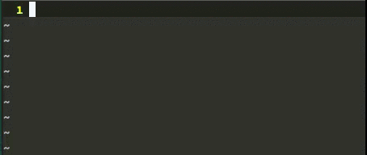

# ruby_hl_lvar.vim

Highlight local variables in Ruby files.



## Requirements

- Vim Ruby interface(`has('ruby')`) enabled and Ruby's version = 2.0.0 (You can check by `:ruby puts RUBY_VERSION`)

Other versions of Rubies, whitch version is >= 1.9.0 may works, but I tested under only 2.0.0.

Bug reports are welcome.

## Usage

Install and open any .rb file. Advanced usage is below.

## Settings

```vim
" Highligt group name for local variable
" Default: 'Identifier'
let g:ruby_hl_lvar_hl_group = 'RubyLocalVariable'

" Auto enable and refresh highlight when text is changed. Useful but bit slow.
" Default: 1
let g:ruby_hl_lvar_auto_enable = 0

" g:ruby_hl_lvar_hl_group highlight priority
" Default: 0
let g:ruby_hl_lvar_highlight_priority = 0

" If you wish to control the plugin manually, map these functions.
nmap <leader>he <Plug>(ruby_hl_lvar-enable)
nmap <leader>hd <Plug>(ruby_hl_lvar-disable)
nmap <leader>hr <Plug>(ruby_hl_lvar-refresh)
```

## Known bugs

- -Sometimes highlight contaminate other buffers- (hopefully fixed)
